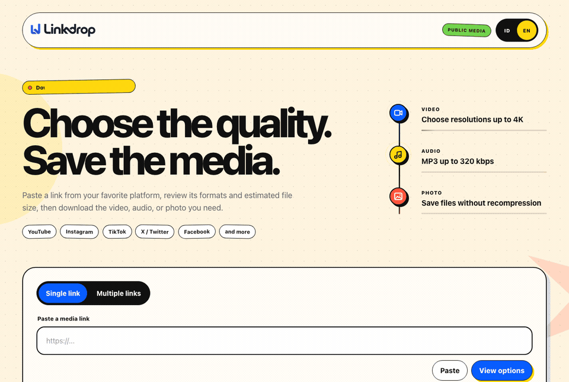

<div align="center">
  

  <h1>Linkdrop</h1>

  <h3>Save public media in the formats your source actually provides.</h3>

  <p><strong>English</strong> · <a href="README.id.md">Bahasa Indonesia</a></p>

  <p>
    <a href="#quick-start-for-windows-recommended">Quick start</a> ·
    <a href="#macos-and-linux">macOS &amp; Linux</a> ·
    <a href="#documentation">Documentation</a> ·
    <a href="#limitations">Limitations</a>
  </p>

  <p>
    <a href="https://github.com/Zvareldric/Linkdrop/actions/workflows/ci.yml"></a>
    
    
  </p>
</div>

---

<p align="center">
  
</p>

Linkdrop is a responsive web app for inspecting and downloading public media you own or are allowed to download. It supports YouTube, Instagram, TikTok, X, Facebook, and other sites supported by [yt-dlp](https://github.com/yt-dlp/yt-dlp).

> Use Linkdrop only for your own media, public-domain media, or content you have permission to download. It does not bypass DRM, private access, CAPTCHA, or platform restrictions.

## What it does

- Shows the real formats and source resolutions available for a public link.
- Downloads video, source audio or MP3, and original photos; multi-image posts become ZIP files.
- Streams download progress and lets users choose where to save the completed file.
- Supports an optional multi-link mode that creates one ZIP package.
- Works on desktop and mobile, with Indonesian and English interfaces.

## Quick start for Windows (recommended)

**Requirements:** [Git for Windows](https://git-scm.com/download/win) and [Docker Desktop](https://www.docker.com/products/docker-desktop/) with the WSL 2 backend.

Open PowerShell and run:

```powershell
git clone https://github.com/Zvareldric/Linkdrop.git
Set-Location Linkdrop

$secret = [Convert]::ToHexString((1..32 | ForEach-Object { Get-Random -Maximum 256 }))
docker build -t linkdrop .
docker run --detach --name linkdrop --restart unless-stopped `
  --publish 127.0.0.1:5050:8080 `
  --env "DOWNLOAD_TOKEN_SECRET=$secret" `
  --env MAX_MEDIA_BYTES=2147483648 `
  linkdrop
```

Open [http://127.0.0.1:5050](http://127.0.0.1:5050). The container binds only to your computer.

## macOS and Linux

Install Python 3.12, FFmpeg, Git, and Deno first. On macOS with Homebrew:

```bash
brew install python@3.12 ffmpeg deno git
```

On Ubuntu 24.04 or another Linux distribution with Python 3.12:

```bash
sudo apt update
sudo apt install --yes git python3.12 python3.12-venv ffmpeg
```

Then, on either system, install and run Linkdrop:

```bash
git clone https://github.com/Zvareldric/Linkdrop.git
cd Linkdrop
python3.12 -m venv .venv
source .venv/bin/activate
python -m pip install -r requirements.txt
export DOWNLOAD_TOKEN_SECRET="$(openssl rand -hex 32)"
PORT=5000 gunicorn --bind 127.0.0.1:5000 --workers 1 --threads 4 --timeout 0 app:app
```

Open [http://127.0.0.1:5000](http://127.0.0.1:5000). Linux users should install Deno 2.3+ or Node.js 22+ through their distribution's supported package source when a JavaScript runtime is needed.

## Documentation

- [Installation](docs/INSTALLATION.md) — Windows/Docker Desktop first, then macOS and Linux.
- [Private phone access](docs/TAILSCALE.md) — access Linkdrop safely through Tailscale.
- [Deployment](docs/DEPLOYMENT.md) — persistent hosting and operational limits.
- [Architecture](docs/ARCHITECTURE.md) — media flow, temporary files, and security model.

## Tests

```bash
source .venv/bin/activate
python -m unittest discover -s tests -v

npm ci
npx playwright install chromium webkit
npm run test:e2e
```

## Limitations

Source websites and their extractors can change or block requests. A platform may require a valid account session, cookies, a PO token, or a supported region; Linkdrop does not circumvent those requirements. MP3 conversion cannot add quality that is absent from the source.

## Maintainer

Maintained by [Zvareldric](https://github.com/Zvareldric).
