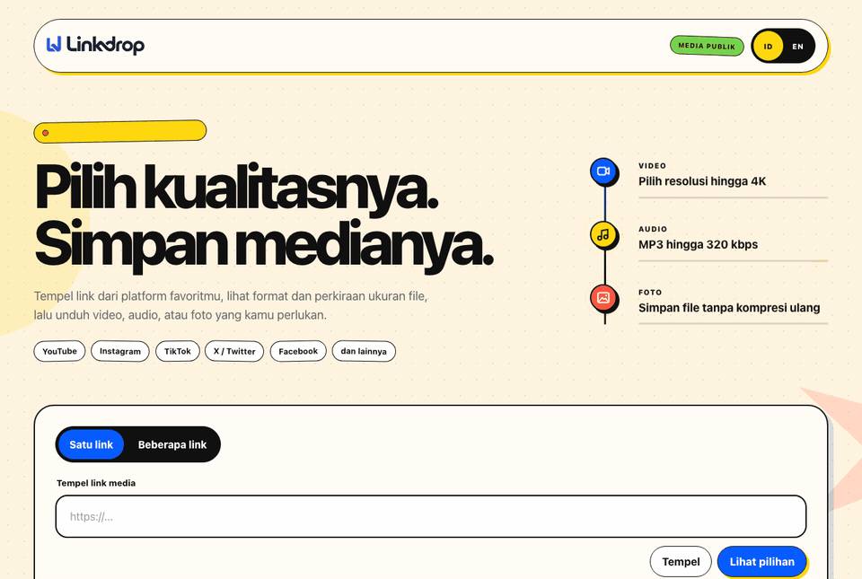

# Linkdrop

[](https://github.com/Zvareldric/Linkdrop/actions/workflows/ci.yml)


**English** · [Bahasa Indonesia](README.id.md)

Linkdrop is a responsive web app for inspecting and downloading public media you own or are allowed to download. It supports YouTube, Instagram, TikTok, X, Facebook, and other sites supported by [yt-dlp](https://github.com/yt-dlp/yt-dlp).



> Use Linkdrop only for your own media, public-domain media, or content you have permission to download. It does not bypass DRM, private access, CAPTCHA, or platform restrictions.

## What it does

- Shows the real formats and source resolutions available for a public link.
- Downloads video, source audio or MP3, and original photos; multi-image posts become ZIP files.
- Streams download progress and lets users choose where to save the completed file.
- Supports an optional multi-link mode that creates one ZIP package.
- Works on desktop and mobile, with Indonesian and English interfaces.

## Quick start

**Requirements:** Python 3.12+, FFmpeg, and Deno 2.3+ or Node.js 22+ for some JavaScript-based source checks.

```bash
git clone https://github.com/Zvareldric/Linkdrop.git
cd Linkdrop

python3 -m venv .venv
source .venv/bin/activate
pip install -r requirements.txt

cp .env.example .env
export DOWNLOAD_TOKEN_SECRET="$(openssl rand -hex 32)"
PORT=5000 gunicorn --bind 127.0.0.1:5000 --workers 1 --threads 4 --timeout 0 app:app
```

Open [http://127.0.0.1:5000](http://127.0.0.1:5000). This setup is for macOS and Linux; see the installation guide for Windows.

## Documentation

- [Installation](docs/INSTALLATION.md) — macOS, Linux, and Windows/Docker Desktop.
- [Private phone access](docs/TAILSCALE.md) — access Linkdrop safely through Tailscale.
- [Deployment](docs/DEPLOYMENT.md) — persistent hosting and operational limits.
- [Architecture](docs/ARCHITECTURE.md) — media flow, temporary files, and security model.

## Tests

```bash
source .venv/bin/activate
python -m unittest discover -s tests -v

npm ci
npx playwright install chromium webkit
npm run test:e2e
```

## Limitations

Source websites and their extractors can change or block requests. A platform may require a valid account session, cookies, a PO token, or a supported region; Linkdrop does not circumvent those requirements. MP3 conversion cannot add quality that is absent from the source.

## Maintainer

Maintained by [Zvareldric](https://github.com/Zvareldric).
